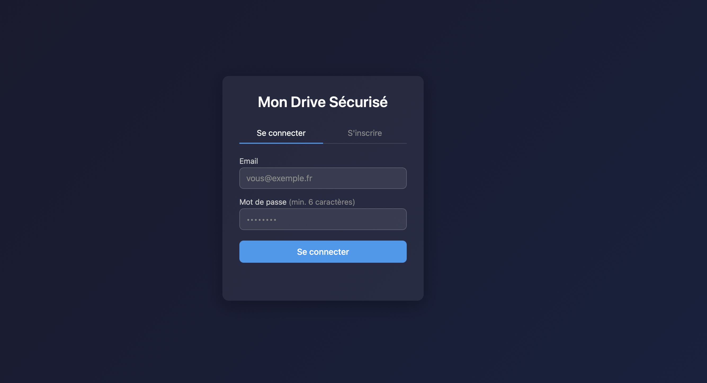
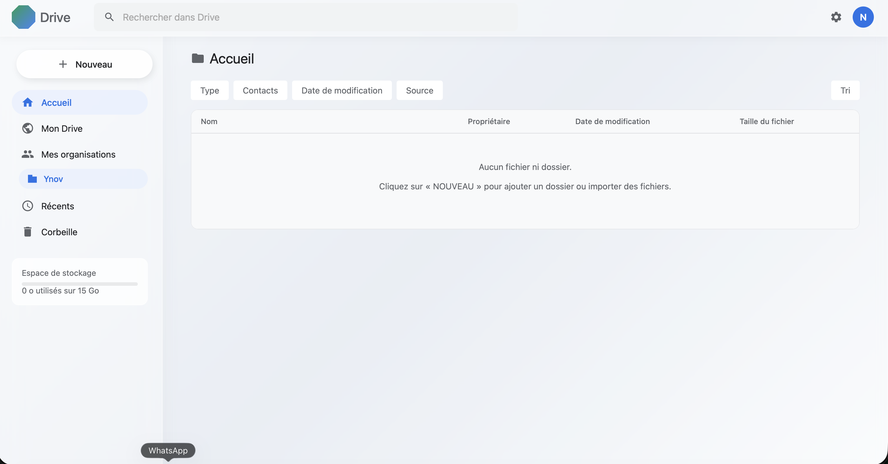
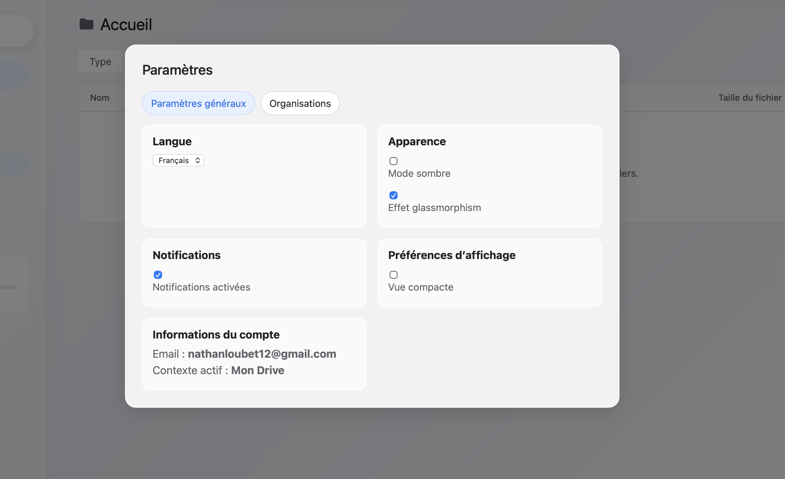
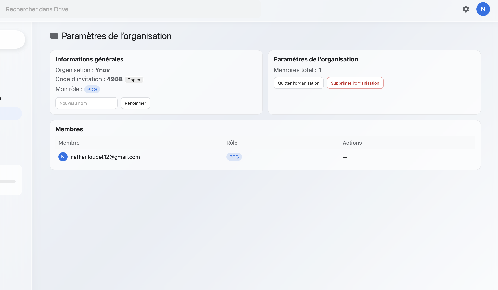

# Documentation Technique — Y-Drive

---

## 1. Présentation du projet

**Y-Drive** est une application web de stockage de fichiers en ligne, comme Google Drive mais en plus simple.

Les utilisateurs peuvent :
- Créer un compte et se connecter
- Uploader, télécharger et supprimer des fichiers
- Organiser leurs fichiers dans des dossiers
- Rejoindre une organisation et partager des fichiers avec ses membres
- Gérer une corbeille (restaurer ou supprimer définitivement)

---

## 2. Architecture du projet

Le projet est composé de 3 parties :

```
Navigateur (HTML/CSS/JS)
        ↕  requêtes HTTP
Serveur Node.js (Express)
        ↕  requêtes SQL
Base de données PostgreSQL
        +
Dossier /uploads (fichiers physiques)
```

### Fichiers principaux

| Fichier | Rôle |
|---|---|
| `server.js` | Serveur principal, toutes les routes API |
| `auth.js` | Inscription, connexion, vérification du token |
| `db.js` | Connexion à la base de données |
| `storage.js` | Gestion de l'upload des fichiers |
| `init.sql` | Création des tables de la base de données |
| `public/` | Pages web (HTML, CSS, JS frontend) |
| `uploads/` | Fichiers uploadés par les utilisateurs |

---

## 3. Choix techniques

| Technologie | Pourquoi |
|---|---|
| **Node.js + Express** | Facile à mettre en place pour une API REST |
| **PostgreSQL** | Base de données relationnelle robuste |
| **JWT** | Authentification sans stocker de session côté serveur |
| **bcrypt** | Hachage sécurisé des mots de passe (ne stocke jamais le vrai mot de passe) |
| **Multer** | Gestion simple de l'upload de fichiers |
| **JavaScript vanilla** | Pas de framework frontend, plus simple à comprendre |

### Comment fonctionne le JWT ?

Quand l'utilisateur se connecte, le serveur génère un **token** (une longue chaîne de caractères). Ce token est stocké dans le navigateur et envoyé à chaque requête pour prouver que l'utilisateur est bien connecté.

```
Connexion → Serveur génère un token → Stocké dans le navigateur
Requête suivante → Token envoyé → Serveur vérifie → Accès autorisé
```

### Comment fonctionne bcrypt ?

Le mot de passe n'est jamais stocké en clair. bcrypt le transforme en une chaîne illisible :
```
"monMotDePasse" → "$2a$12$xK9m...hashed" (stocké en base)
```
À la connexion, bcrypt compare le mot de passe saisi avec le hash stocké.

---

## 4. Plan d'adressage (routes API)

Le serveur tourne sur `http://localhost:7030`.

### Routes publiques (sans connexion)

| Méthode | Route | Description |
|---|---|---|
| `GET` | `/` | Page de connexion |
| `POST` | `/register` | Créer un compte |
| `POST` | `/login` | Se connecter |
| `GET` | `/health` | Vérifier que le serveur fonctionne |

### Routes protégées (nécessitent un token JWT)

**Utilisateur**

| Méthode | Route | Description |
|---|---|---|
| `GET` | `/me` | Récupérer son profil |

**Organisations**

| Méthode | Route | Description |
|---|---|---|
| `POST` | `/organizations` | Créer une organisation |
| `POST` | `/organizations/join` | Rejoindre une organisation avec un code |
| `POST` | `/organizations/switch` | Changer d'organisation active |
| `POST` | `/organizations/leave` | Quitter une organisation |

**Dossiers**

| Méthode | Route | Description |
|---|---|---|
| `GET` | `/folders` | Lister ses dossiers |
| `POST` | `/folders` | Créer un dossier |
| `DELETE` | `/folders/:id` | Supprimer un dossier |
| `POST` | `/api/folders/:id/unlock` | Déverrouiller un dossier confidentiel |

**Fichiers**

| Méthode | Route | Description |
|---|---|---|
| `POST` | `/api/upload` | Uploader un fichier |
| `GET` | `/api/files` | Lister ses fichiers |
| `DELETE` | `/api/files/:id` | Mettre un fichier en corbeille |
| `POST` | `/api/files/:id/restore` | Restaurer depuis la corbeille |
| `DELETE` | `/api/files/:id/permanent` | Supprimer définitivement |
| `DELETE` | `/api/files/trash/empty` | Vider la corbeille |
| `POST` | `/api/files/:id/move` | Déplacer dans un dossier |
| `GET` | `/api/files/:id/download` | Télécharger un fichier |
| `GET` | `/api/storage` | Voir l'espace utilisé |

---

## 5. Base de données

La base s'appelle `drive_db` et contient 4 tables :

```
organizations          users
─────────────         ─────────────────────
id                    id
name                  email
code (4 chiffres)     password_hash
                      role (PDG / MANAGER / COLLABORATEUR)
                      org_id → organizations.id


folders                files
──────────────────    ──────────────────────────
id                    id
name                  original_name
type (normal /        stored_name (nom sur disque)
  shared /            size
  confidential)       uploaded_by → users.id
owner_id → users.id   org_id → organizations.id
org_id                folder_id → folders.id
owner_space           owner_space (personal / organization)
                      created_at
                      deleted_at (NULL = actif, date = corbeille)
```

La colonne `deleted_at` dans `files` permet la **corbeille** : quand on supprime un fichier, on met juste la date de suppression. Le fichier est vraiment effacé seulement quand on vide la corbeille.

---

## 6. Scripts SQL

### Initialisation complète — `init.sql`

Ce script crée toutes les tables depuis zéro.

```bash
psql -U postgres -d drive_db -f init.sql
```

### Migrations (mises à jour progressives)

Si la base existe déjà, appliquer les scripts dans cet ordre :

```bash
psql -U postgres -d drive_db -f migrations/add-org-code.sql
psql -U postgres -d drive_db -f migrations/add-user-organization-memberships.sql
psql -U postgres -d drive_db -f migrations/add-owner-space-columns.sql
psql -U postgres -d drive_db -f migrations/add-files-table.sql
psql -U postgres -d drive_db -f migrations/add-deleted-at-files.sql
```

---

## 7. Procédure d'installation

### Prérequis
- Node.js installé
- PostgreSQL installé

### Étapes

**1. Installer les dépendances**
```bash
npm install
```

**2. Créer la base de données**
```bash
psql -U postgres -c "CREATE DATABASE drive_db;"
psql -U postgres -d drive_db -f init.sql
```

**3. Configurer le fichier `.env`**
```bash
cp .env.example .env
```
Puis remplir le fichier `.env` :
```env
DB_HOST=localhost
DB_PORT=5432
DB_NAME=drive_db
DB_USER=postgres
DB_PASSWORD=ton_mot_de_passe
JWT_SECRET=une_cle_secrete_longue
PORT=7030
```

**4. Démarrer le serveur**
```bash
npm start
```

**5. Ouvrir dans le navigateur**
```
http://localhost:7030
```

---

## 8. Captures d'écran

### Page de connexion



La page d'accueil permet de se connecter ou de créer un compte. Un champ optionnel permet d'entrer un code d'organisation à l'inscription.

### Interface principale



L'interface principale affiche la barre latérale avec la navigation (Mon Drive, Mes organisations, Récents, Corbeille), la liste des fichiers et l'espace de stockage utilisé.

### Paramètres du compte



La page des paramètres permet de modifier l'apparence (mode sombre, glassmorphism), les notifications, la langue, et affiche les informations du compte connecté.

### Paramètres de l'organisation



Le PDG peut voir le code d'invitation, la liste des membres avec leur rôle, et gérer l'organisation (renommer, exclure un membre, supprimer).

---

*Documentation technique — Y-Drive v1.0.0*
